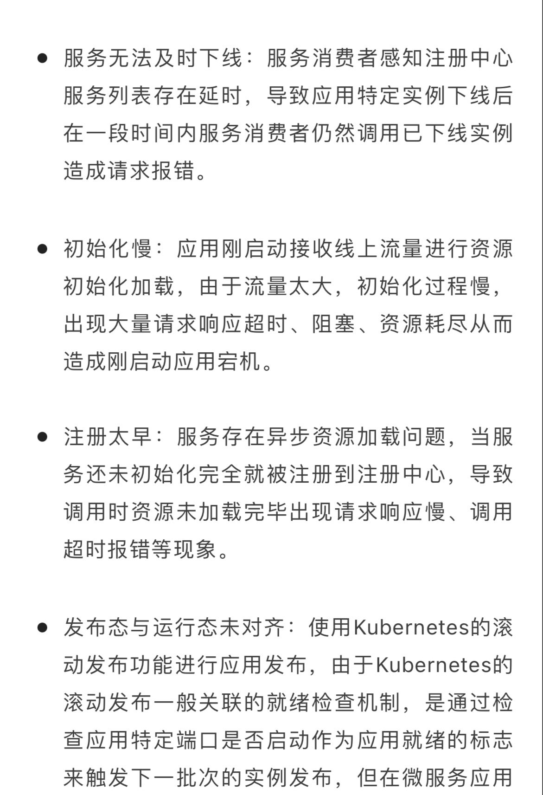

# K8S

### 测试环境迁移到k8s

1. mysql问题:

   mysql内token字段由100改为256,但是DBA操作错误,导致登录测试时,一直失败

2. 域名解析问题

3. apollo配置:

   早期apollo账号经过base64加密后,长度超过限制,因此mysql账号少写几位,迁移apollo后,新环境的配置,是最新的apollo账号,但是旧apollo用户密码未改,导致连接失败,pod健康检查失败

### 访问域名报`服务器异常或没网络`

1. F12,发现请求imp-test5报405错误
2. 手动访问`https://imp-test5.wsecar.com/accountWebImpl`,请求失败,不存在路径
3. 查看服务对应Service,配置正确
4. 查看imp-test5对应Ingress,发现更新转发配置,只有`/api/accountWebImpl/`转发,手动添加`/accountWebImpl`
5. 请求域名,报404,请求资源不存在.查看imp-test5的ingress配置文件,少了后半截,手动添加`rewrite ^/api/accountWebImpl/(.*) /$1 break;rewrite ^/accountWebImpl/(.*) /$1 break;`
6. 请求,回复正常

### 华为云容器服务

* 监听器个数不够,导致整个容器集群不可用

### k8s生产故障

[k8s网络诊断之我的流量去哪了](https://developer.aliyun.com/article/780661)

### k8s遇到的问题

### 测试环境电商服务调用网约车服务不通

* 问题现象:
  * 电商虚拟机环境服务调用网约车k8s环境一个服务,1个通1个不通,网约车这边两个服务都是正常的
* 问题排查:
  * telnet不通有2种原因,1个是端口未启动,另一个是安全组问题
* 问题原因:
  * 虚拟机调用容器是通过entbus转发的,entbus的svc绑定多个服务端口,转发给entbus的pod,由entbus的pod转发给具体的后端服务,具体的转发规则通过configmap挂载到pod内
  * 一开始fat06环境是没有挂载entbus-configmap,但是18930端口是通的,18933端口不通,以为不需要entbus-configmap,排查方向就一直在安全组
  * 后面发现,entbus-pod内部默认有一些规则的,18930刚好有,所以即时没挂载configmap,也是通的

### 服务扩容后,业务反馈kibana搜不到部分服务日志

* 问题现象:
  * 服务扩容后,研发反馈kibana搜不到部分服务的日志
* 问题排查:
  * 因为今天刚好扩容了2个node节点,怀疑是节点问题,对比后发现,扩容的服务,部署在其他节点上的pod日志能搜到,部署在这2个节点上的都搜不到
  * 查看2个问题节点的daemonset是否部署的filebeat,发现filebeat已部署
  * 查看filebeat配置文件,发下宿主机的日志目录为空
  * 再登录pod查看,pod上的log目录也为空,发现log目录无写入权限
* 问题解决
  * 找到同事咨询,说要把宿主机的log目录,手动赋权777,再重新部署新节点上的所有Pod
* 改进
  * 原因待补充:好像是因为写入权限问题,k8s负责的同事没解决这个问题,所以目前所有新节点,都需要改log目录权限
  * 遇到问题,应尽可能解决,而不是通过一些人工手段处理;而且这个问题,没有同步给所有同事

### 权限服务容器化导致问题

* 问题现象:
  * 权限服务凌晨容器化时,由于是后台管理类服务,所以未验证,直接切流了,导致生产故障,后回滚恢复(领导在用,发现用不了了,为了不影响使用,回滚了)
  * 云办公app无法使用
* 问题排查:
  * 回滚后业务恢复,排查问题
  * 回滚后,发现还有告警一直未恢复,排查
  * ingress健康检查告警,oapermissionclient服务503(ingress在腾讯云,后端在华为云,该服务是权限认证服务)
  * 排查发现后端服务正常,但是在腾讯云telnet不通,发现entbus-gateway服务出现故障(nginx服务,负责转发请求)
  * 登录entbus-gateway的pod,nginx -t失败,而且该pod一个nginx端口都未监听,找到问题原因,今晚要上线的一个服务,未绑定service,而nginx配置的upstream是通过服务名.svc.cluster.local去转发请求的,该服务未创建service,导致nginx加载失败
* 问题解决:
  * 把服务绑定svc控制器,重新发布,再重发entbus-gateway服务后恢复

* 复盘:
  1. 准备工作未到位,没检查到服务没绑定svc控制器
  2. 未切流前,先发布了entbus-gateway服务,发布后,其实有ingress告警,但是忙着变更,没关注,如果此时就停止变更,不会发生线上故障
  3. 正常情况,发布entbus-gateway服务时,如果配置有问题,新的pod应该会无法ready,旧的pod会一直存在,但是变更时,有去检查这里,发现entbus-gateway服务新的pod是ready了的
  4. 直接切流原因一个是因为后台管理类服务,觉得即时有问题,也不会影响到网约车服务(从意识上没太重视),而且到凌晨了,觉得应该没人用了,就跳过了验证这个步骤

* 额外的问题:
  * 因为凌晨还有几个服务要发版,在容器化失败后,就把服务发了
  * 我们有个jenkins有个选项是为了容器化使用的,就是使用线上稳定版本发布,而因为我容器化,脚本里这个参数就选的Yes,没意识到这个,导致要发版的服务,就用了线上稳定版本重发了,相当于没发最新版本

